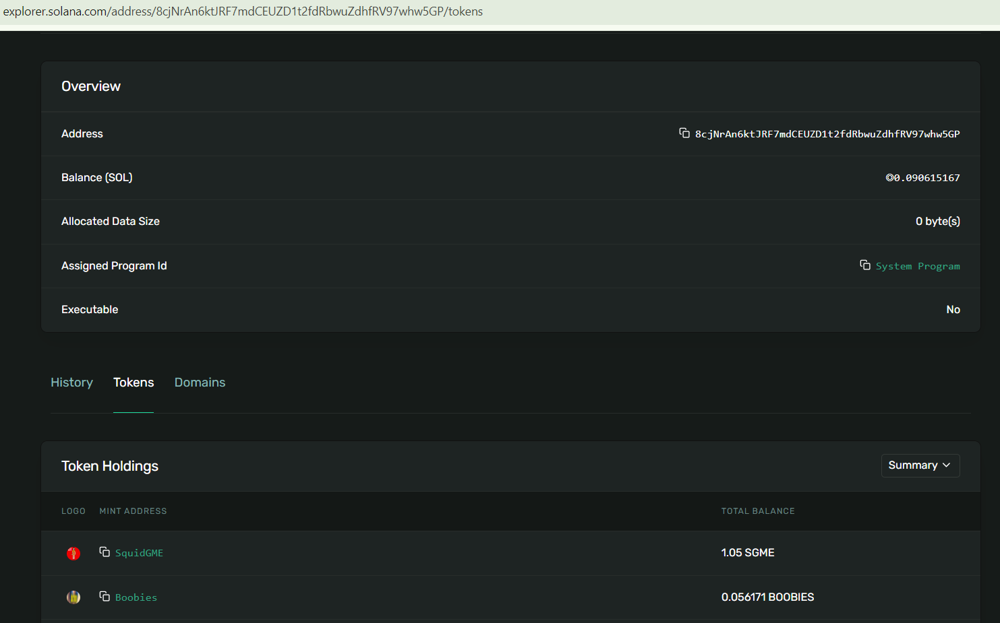

# Pump Fun Swap Transaction
This test project aims to execute swap transaction on the pump.fun. <br/>

Input Params:
```
- Wallet secret Key (Save in the .env file so that it can't be shared with others. I added example.env and you can customize it.)

- Token Mint Address (Token address you want to buy or sell)
```

Running command:
```
  npm install
  npm start
```

1. Check the associated token is existed in my wallet.
2. Create associated token account within my wallet if not exist.
3. Invoke the buy or sell function on the IDL of pump.fun program.

# Output
Here, I would like to show the output of this project.

 <br/>
This is the image of my wallet (phantom)


<br/>
This is the image of my account for tokens.


<br/>
This is the image of transaction details